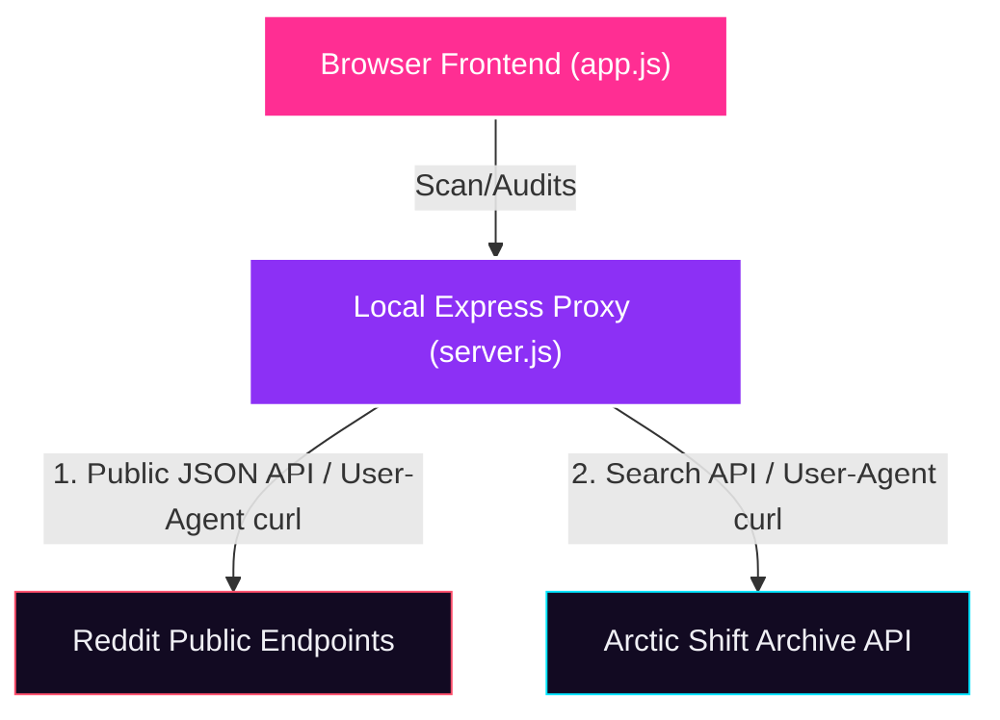

<div align="center">

```text
  _____            __ _ _ _      
 |  __ \          / _(_) (_)     
 | |__) | __ ___ | |_ _| |___  __
 |  ___/ '__/ _ \|  _| | | \ \/ /
 | |   | | | (_) | | | | | |>  < 
 |_|   |_|  \___/|_| |_|_|_/_/\_\
```

**A premium, privacy-first dashboard designed to help users reclaim their deleted Reddit content, audit their digital footprint, and analyze subreddit activity in real time.**

🚀 **Live Deployment:** [profilix.onrender.com](https://profilix.onrender.com/)

[](https://profilix.onrender.com/)
[](LICENSE)
[](https://nodejs.org/)
[](https://expressjs.com/)
[](CONTRIBUTING.md)
[](#)

---

[Key Features](#-key-features) • [System Architecture](#%EF%B8%8F-system-architecture) • [Getting Started](#-getting-started) • [Reddit TOS Compliance](#%EF%B8%8F-reddit-tos-compliance) • [Contributing](#-contributing)

</div>

---

## 🔍 Overview

**Profilix** is a self-contained, open-source user analysis engine and self-auditing dashboard. Its **primary motive** is to empower users to reclaim, audit, and recover their own deleted posts, removed comments, and historical digital footprints.

Unlike standard tools, Profilix employs a **dual-pipeline fetch architecture**: it retrieves live data directly from Reddit while querying the third-party **Arctic Shift archive** in parallel to index deleted and removed data. By merging these pipelines, Profilix acts as a recovery mirror for your personal posting history.

All user data remains strictly in local browser memory and is visualized via interactive Chart.js widgets. Scans are 100% anonymous, safe, and require no account registration.

---

## ⚡ Key Features

* 👻 **Recover Deleted Content (Primary Motive):** Retrieve and audit your own deleted posts, removed comments, and historical footprints that are no longer visible on your live Reddit profile.
* 📇 **Dual-Fetch Pipeline:** Queries live Reddit JSON feeds and Arctic Shift historical search indices concurrently.
* 🛡️ **Resilient Request Ingestion:** Employs a browser-based JSONP request model as a dynamic fallback, allowing the application to utilize the user's browser IP to bypass server-side datacenter blocks (WAF/CDN) transparently.
* 🖼️ **Inline Image & Video Previews:** Renders post images and native HTML5 video players inside the dashboard feeds using an Express proxy fallback.
* 📊 **Subreddit Frequency Chart:** Dynamic doughnut visualization displaying user activity distribution across subreddits.
* 🖱️ **Header Filter & Sorting:** Quick text-matching queries and sorting filters (Newest, Oldest, Top Voted) running entirely client-side.
* 📤 **Structured CSV Exports:** Download full timeline datasets with a single click.
* 🎨 **Rich Aesthetics:** Dark/light mode theme toggling, modern Outfit typography, glassmorphism card panels, interactive 3D perspective tilts, and smooth scroll triggers.

---

## 🏗️ System Architecture

Profilix separates its presentation logic from API ingestion using an unauthenticated Node.js CORS proxy:



---

## 🚀 Getting Started

### Prerequisites
You must have [Node.js](https://nodejs.org/) installed (v18.x or higher is recommended).

### Installation & Run

1. **Clone the Repository:**
   ```bash
   git clone https://github.com/anshkr95/profilix.git
   cd profilix
   ```
2. **Install Dependencies:**
   ```bash
   npm install
   ```
3. **Start the Application:**
   ```bash
   npm start
   ```
4. **Open in Browser:**
   Navigate to `http://localhost:3000` to start scanning.

---

## ⚖️ Reddit TOS Compliance

Profilix is fully committed to ethical, non-invasive data auditing. The codebase adheres strictly to Reddit's developer rules and terms of service:
* **No Authentication Bypassing:** We do not bypass login checkpoints, CAPTCHAs, or authentication firewalls. We do not access direct messages or private/moderator subreddits.
* **Strictly Public Feeds:** We only query public unauthenticated endpoints (e.g., standard `.json` profiles) exposed to standard search engine crawlers.
* **No Local Database Storage:** We do not index, crawl, or store user information in persistent data stores. Data is kept in-memory client-side and deleted instantly when the browser tab is closed.
* **Third-Party Archives:** Deleted posts/comments are requested from the community-driven **Arctic Shift** project, keeping the archival pipeline separate from Reddit's live infrastructure.

---

## 🤝 Contributing

We welcome contributors! Profilix is an open-source project, and we actively encourage developers, researchers, and OSINT enthusiasts to collaborate.

Whether you want to optimize API fetching, add new visualization modules, or squash bugs, here is how you can get involved:

### 💡 Ideas for Contribution
* **Enhanced Visualizations:** Add timeline heatmaps or activity grids (similar to GitHub contribution calendars).
* **Additional Archives:** Integrate other archival databases (like Wayback Machine or local dumps).
* **Performance Enhancements:** Improve state management and frontend caching.
* **UI/UX Refinements:** Propose updates to the responsive layout, animations, or styling tokens.

To get started:
1. Review the [Code of Conduct](CODE_OF_CONDUCT.md).
2. Read our [Contributing Guidelines](CONTRIBUTING.md) to understand the branch workflow.
3. Check the open issues or create a new one to propose a feature.

---

## 📄 License

Distributed under the MIT License. See [LICENSE](LICENSE) for more information.
